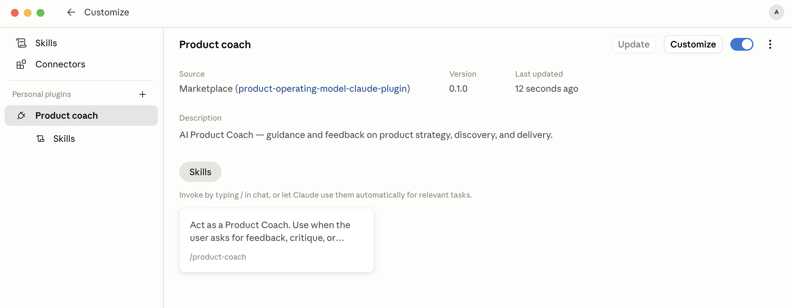
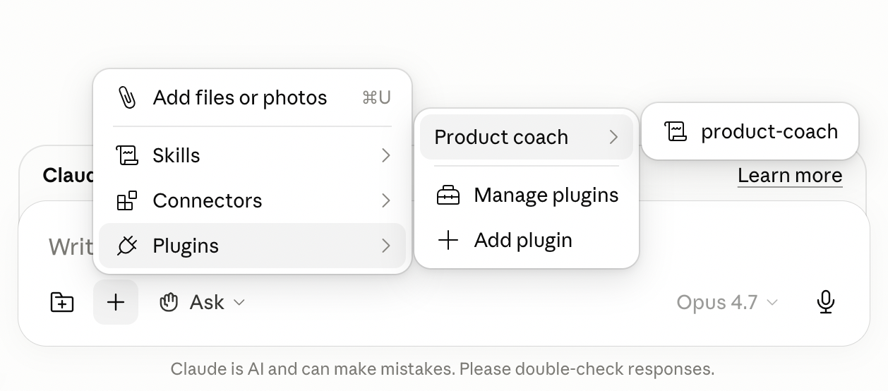

# product-operating-model-claude-plugin

A custom Claude Code / Cowork **marketplace** that distributes the **Product Coach** plugin — an AI coach grounded in modern product operating model practices.

## Repository layout

```
.
├── .claude-plugin/
│   └── marketplace.json                  # marketplace catalog
└── plugins/
    └── product-coach/
        ├── .claude-plugin/
        │   └── plugin.json               # plugin manifest
        └── skills/
            └── product-coach/
                └── SKILL.md              # the coaching skill
```

## Install

In Claude Code or Cowork:

```
/plugin marketplace add alexeyhimself/product-operating-model-claude-plugin
/plugin install product-coach@product-operating-model
```

Once installed, the plugin shows up in Cowork:



## Use

After install, the `product-coach` skill triggers automatically when you ask for feedback or guidance on product strategy, discovery, roadmaps, OKRs, PRDs, etc.



## Status

Proof of concept. Version `0.1.0`.
